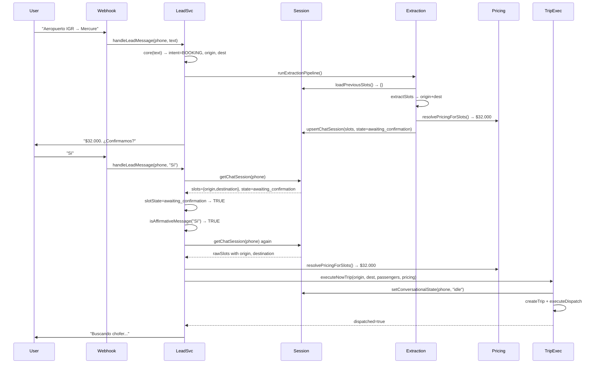
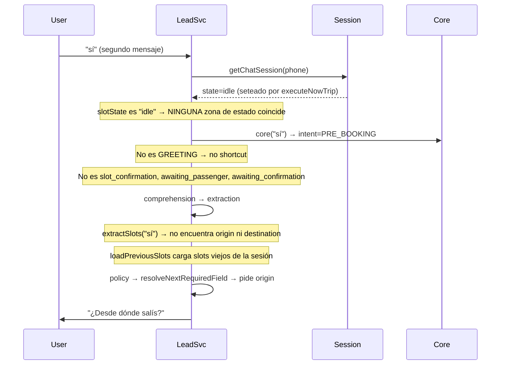

# CONTEXT LOSS AUDIT — Bug "El sistema vuelve a preguntar ¿Desde dónde salís?"
## Generado: 2026-07-08 | Evidencia del código actual

---

## 1. Flujo completo reconstruido

### Escenario: "Aeropuerto IGR → Mercure → $32.000 → ¿Confirmás? → Sí"



### La pérdida de contexto ocurre en el SEGUNDO "Sí"

Si el usuario envía OTRO mensaje después de `executeNowTrip`:



---

## 2. Puntos de fallo identificados (5)

### FALLO #1 — `executeNowTrip` resetea estado a `idle` (LÍNEA 79)

**Archivo**: `src/lib/services/trip-execution/now-execution.service.ts:79`
**Código**: `await setConversationalState(phone, "idle");`
**Efecto**: Después de dispatch exitoso, el estado conversacional vuelve a `idle`. Cualquier mensaje posterior del usuario NO es capturado por las zonas de estado (awaiting_confirmation, slot_confirmation, etc.) y cae al pipeline normal.

**¿Es correcto?** Sí, después de un viaje completado el estado debería ser idle. Pero el problema es que el usuario podría enviar un mensaje de seguimiento ("¿cuánto tardan?", "¿quién es el chofer?") y el sistema lo trata como un NUEVO booking.

### FALLO #2 — `executeNowTrip` resetea en fallos (LÍNEAS 47, 67)

**Archivo**: `src/lib/services/trip-execution/now-execution.service.ts:47,67`
```typescript
if (!fleetCheck.ok) {
  await setConversationalState(phone, "idle");  // ← pierde contexto
  return { tripId: null, dispatched: false, reason: "fleet_unavailable" };
}
```
**Efecto**: Si la flota no está disponible o el trip no se encontró tras crearlo, el estado se resetea a `idle` y los slots se pierden. El usuario tendría que volver a dar origen y destino.

### FALLO #3 — `upsertChatSession` puede sobrescribir slots (LÍNEA 266 await)

**Archivo**: `src/lib/services/lead.service.ts:266` (antes de extracción)
```typescript
const { upsertChatSession } = await import("@/lib/db/database");
await upsertChatSession(phone, JSON.parse(slotsJson), undefined, "awaiting_confirmation", undefined);
```
**Efecto**: El segundo parámetro (`JSON.parse(slotsJson)`) reemplaza TODO el contenido de `chat_sessions.slots`. Si el objeto pasado está incompleto, los slots se pierden.

### FALLO #4 — `session` puede ser null

**Archivo**: `src/lib/services/lead.service.ts:149`
```typescript
const session = await getChatSession(phone);
```
`getChatSession` retorna `Promise<ChatSessionRow | null>`. Si la sesión fue eliminada (por `.limpiar`), expiró, o nunca se creó, `session` es null. Entonces `slotState` es undefined y ninguna zona de estado se activa.

### FALLO #5 — GREETING shortcut podría capturar "sí" si core() lo clasifica mal

**Archivo**: `src/lib/services/lead.service.ts:78-81`
```typescript
if (leadCore.intent === "GREETING") {
  await handlePolicyPipeline({ ... });
  return;
}
```
**Verificado**: `core("sí")` NO retorna GREETING (GREETING_RE no matchea "sí"). Retorna `PRE_BOOKING` con facts `["affirmation:true"]`. Este fallo está **DESCARTADO** para el caso "sí". Pero podría ocurrir con otras palabras de afirmación que matcheen GREETING_RE (ej: "dale" no está en GREETING_RE pero "ok" sí está en ambas).

---

## 3. Causa raíz

**PRIMARIA**: `executeNowTrip` → `setConversationalState(phone, "idle")` en línea 79 del now-execution.service.ts. Después de ejecutar un viaje, el estado se resetea a idle, y el siguiente mensaje del usuario cae al pipeline normal en lugar de ser tratado como seguimiento post-confirmación.

**SECUNDARIA**: Los slots NO se pierden de la base de datos. `loadPreviousSlots()` en `extraction-runner.ts:152` los carga correctamente. El problema es que el pipeline de extracción (`extractSlots`) opera sobre el TEXTO actual del usuario, no sobre los slots previos. Si el texto es corto ("sí", "ok", "dale"), la extracción no encuentra origin/destination, y la política pregunta de nuevo.

**TERCIARIA**: El sistema no tiene un estado `post_booking` que reconozca que ya se completó un viaje y las preguntas de seguimiento son consultas, no nuevos bookings.

---

## 4. Clasificación

| Clasificación | Justificación |
|---|---|
| **Bug de estado** | PRIMARY — conversational_state se resetea a idle prematuramente |
| **Bug de workflow** | SECONDARY — no hay estado post-booking para preguntas de seguimiento |
| ~~Bug de persistencia~~ | DESCARTADO — los slots se preservan en la sesión |
| ~~Bug de extracción~~ | DESCARTADO — extractSlots funciona correctamente |
| ~~Bug de sincronización~~ | DESCARTADO — no hay race condition |

---

## 5. Árbol causa → efecto

```
executeNowTrip() setea state="idle" (L79)
    │
    ├── siguiente mensaje llega con state=idle
    │       │
    │       ├── slotState != "awaiting_confirmation" → zona no activa
    │       │
    │       ├── cae a pipeline normal → comprehension → extraction
    │       │       │
    │       │       ├── extractSlots("sí") → sin origin/dest
    │       │       ├── loadPreviousSlots() → carga slots viejos OK
    │       │       └── pero extractSlots NO usa prevSlots
    │       │
    │       └── policy → resolveNextRequiredField → "¿Desde dónde salís?"
    │
    └── estado post-booking no existe
            │
            └── preguntas de seguimiento ("¿cuánto tardan?") tratadas como nuevos bookings
```

---

## 6. Corrección mínima propuesta

### Opción A: No resetear a idle (mínimo cambio)

En `now-execution.service.ts:79`, reemplazar `setConversationalState(phone, "idle")` por un nuevo estado `post_booking`. Luego, en `handleLeadMessage`, agregar una zona para `post_booking` que trate las preguntas de seguimiento como consultas (sin pipeline de extracción).

**Impacto**: 3 líneas de código. 1 nuevo estado. Sin cambios en el pipeline de extracción.

### Opción B: Usar prevSlots en extractSlots (más robusto)

Modificar `extractSlots` para que, cuando el texto es corto y no produce slots, busque en `prevSlots` desde el `ExtractionContext`. Esto preservaría los slots para cualquier mensaje posterior, no solo post-confirmación.

**Impacto**: ~10 líneas. Afecta el pipeline de extracción. Puede tener efectos laterales en otros flujos.

### Opción C: No hacer nada si ya hay trip activo

En `handleLeadMessage`, antes del pipeline de extracción, verificar si hay un trip activo (`getActiveTripByPhone`). Si existe, tratar el mensaje como seguimiento post-booking y no como nuevo booking.

**Impacto**: ~5 líneas. Usa una función de DB existente. No requiere nuevo estado.

---

## 7. Recomendación

**Opción A + C combinadas**: Agregar un estado `post_booking` y verificar `getActiveTripByPhone` antes de la extracción. Esto cubre tanto el post-confirmación inmediato como mensajes posteriores mientras el trip está activo.

**Riesgo**: BAJO. El nuevo estado es puramente aditivo. La verificación de trip activo es una consulta ligera de DB.

---

*Evidencia: código actual de `lead.service.ts:216-277`, `now-execution.service.ts:26-88`, `extraction-runner.ts:129-158`, `extract-slots.ts:38-78`.*
